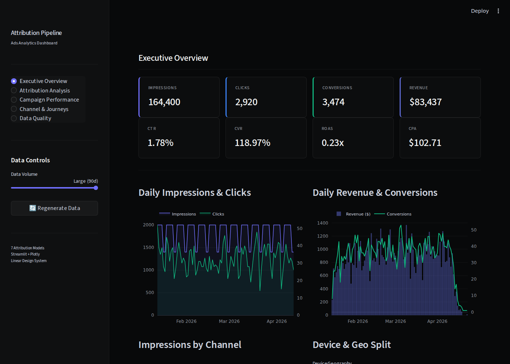
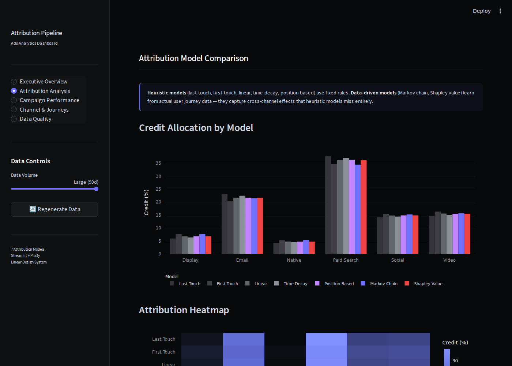
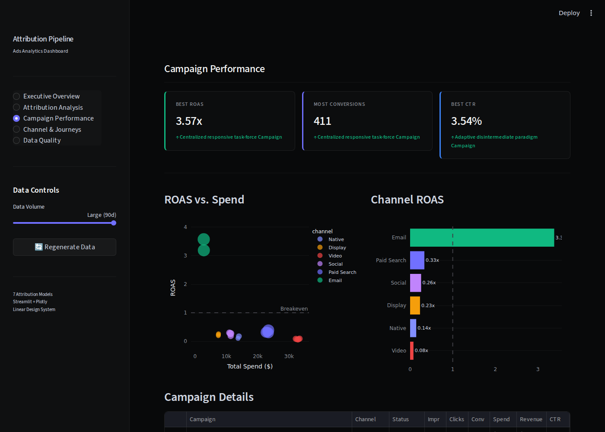
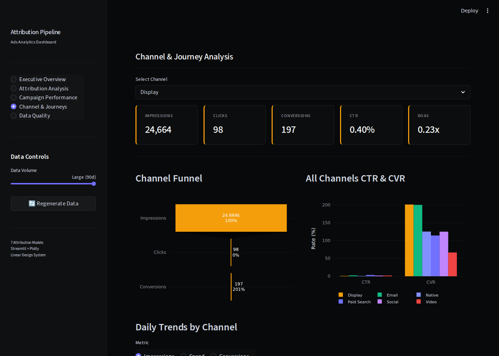
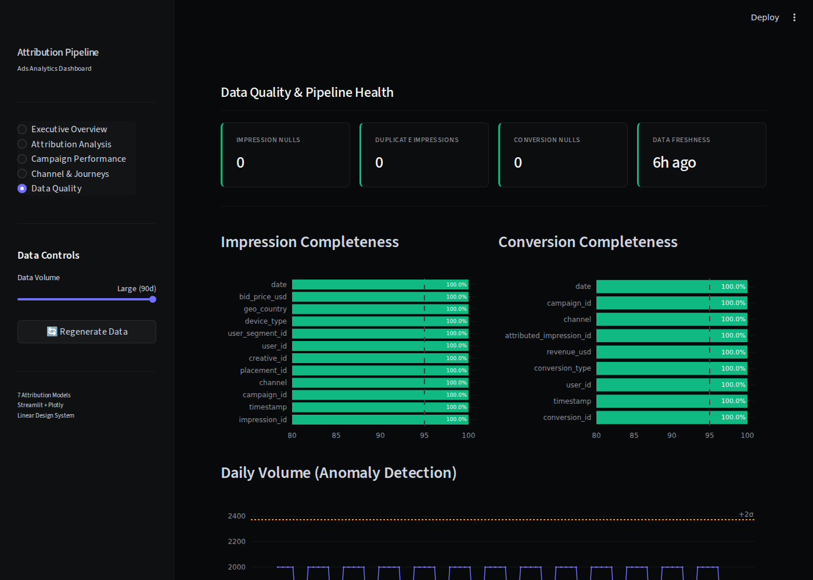

# Ads Attribution Metrics Pipeline

> End-to-end analytics engineering pipeline that ingests ad impression, click, and conversion event data across 7 marketing channels, runs both heuristic and data-driven attribution models (Markov chain, Shapley value), and exposes an interactive 5-page Streamlit dashboard for self-service analytics.

## Why I Built This

Working in ad tech, I kept running into the same problem: business teams needed to understand which ads actually drove real-world outcomes (store visits, purchases), but the data was fragmented across impression logs, conversion events, and third-party attribution signals. Every analysis was a one-off SQL query, and nobody trusted the numbers because there was no single source of truth.

Worse, most teams relied on last-touch attribution — giving 100% credit to the final ad before conversion. This systematically overvalues bottom-funnel channels (paid search) and undervalues upper-funnel channels (display, video) that initiate awareness. Data-driven models like Markov chains and Shapley values fix this by learning from actual user journey data.

This project is my take on building that foundation — a clean, tested, observable pipeline with both heuristic and probabilistic attribution models, plus an interactive dashboard that lets business teams explore the data without filing a data request.

## Architecture

```
[Ad Impression Events]                                   [GCS Raw Zone]
[Click Events]          →  [Cloud Composer / Airflow]  → (Parquet, partitioned)
[Conversion Events]            (orchestration)
[Campaign Metadata]                                            ↓
                                                  ┌────────────────────────┐
                                                  │  BigQuery Staging      │
                                                  │  (type-cast, dedup)    │
                                                  └───────────┬────────────┘
                                                              ↓
                                                  ┌────────────────────────┐
                                                  │  dbt Transformations   │
                                                  │  (joins, enrichment)   │
                                                  └───────────┬────────────┘
                                                              ↓
                               ┌──────────────────────────────┼──────────────┐
                               ↓                              ↓              ↓
                   ┌───────────────────┐        ┌──────────────────┐  ┌──────────────┐
                   │  Attribution       │        │  BigQuery Marts  │  │  Data Quality│
                   │  Engine (Python)   │        │  (business       │  │  Checks      │
                   │                    │        │   metrics)       │  │              │
                   │  - Markov Chain    │        └────────┬─────────┘  └──────────────┘
                   │  - Shapley Value   │                 │
                   │  - Position Based  │                 ↓
                   │  - Last/First Touch│       ┌──────────────────┐
                   │  - Linear          │       │  Streamlit       │
                   │  - Time Decay      │──────▶│  Dashboard       │
                   └───────────────────┘       │  (5 pages)       │
                                               └──────────────────┘
```

## Tech Stack

| Layer | Tool | Why This Tool |
|-------|------|---------------|
| Orchestration | Apache Airflow (Cloud Composer) | Production-grade scheduling with deep GCP integration |
| Ingestion | Python + GCS | Flexible for multiple source formats (JSON, CSV, Parquet) |
| Storage | BigQuery | Serverless, columnar, handles TB-scale ad event data cost-effectively |
| Transformation | dbt | SQL-first, version controlled, testable — metrics logic business teams can trust |
| Attribution Engine | Python (pandas, numpy) | 7 models: 4 heuristic + Markov chain + Shapley value + position-based |
| Data Quality | dbt tests + custom Python checks | Schema enforcement, freshness, completeness, anomaly detection |
| Visualization | Streamlit + Plotly | Interactive 5-page dashboard with real-time filtering |
| Monitoring | Structured logging (structlog) | JSON-formatted observability into pipeline execution |

## What's Inside

```
dashboards/
  app.py                - Main Streamlit entry point (5-page navigation)
  config.py             - Color palette, custom CSS, reusable UI components
  data_loader.py        - Data loading with Streamlit caching + auto-generation
  pages_overview.py     - Executive Overview: KPIs, daily trends, channel/device/geo breakdowns
  pages_attribution.py  - Attribution Analysis: 7-model comparison, heatmap, divergence analysis
  pages_campaigns.py    - Campaign Performance: ROAS scatter, efficiency matrix, detail tables
  pages_channels.py     - Channel & Journeys: funnel viz, hourly patterns, conversion mix
  pages_quality.py      - Data Quality: completeness, anomaly detection, volume monitoring

src/
  ingestion/
    impression_loader.py  - Extracts, validates, loads impression events (GCS + BigQuery)
    conversion_loader.py  - Extracts, validates, handles late-arriving conversions
  metrics/
    attribution.py        - Heuristic models: last-touch, first-touch, linear, time-decay
    advanced_attribution.py - Data-driven: Markov chain (removal effect), Shapley value,
                              position-based (U-shaped), journey builder
    campaign_metrics.py   - CPM, CTR, CVR, ROAS, CPA, frequency, fill rate calculations
  transform/              - PySpark transformations (extensible)
  utils/
    config.py             - Environment-based pipeline configuration
    data_generator.py     - Synthetic data: 7 channels, realistic CTRs, click + conversion gen
    quality_checks.py     - Schema, completeness, freshness, duplicate, value range checks
    logging_config.py     - Structured JSON logging

dags/
  ads_attribution_dag.py  - Airflow DAG: daily orchestration pipeline

models/
  staging/                - dbt: clean, type-cast, deduplicate raw events
  intermediate/           - dbt: join impressions <> conversions, time-to-conversion
  marts/                  - dbt: campaign-level business metrics

tests/                    - pytest: attribution model tests, quality check tests
docs/                     - Architecture docs, open-source landscape research
```

## Attribution Models

The pipeline implements **7 attribution models** — 4 heuristic (rule-based) and 3 data-driven (learned from user journey data):

### Heuristic Models

| Model | Logic | Best For |
|-------|-------|----------|
| **Last Touch** | 100% credit to final touchpoint before conversion | Direct response campaigns |
| **First Touch** | 100% credit to first touchpoint in journey | Brand awareness measurement |
| **Linear** | Equal credit across all touchpoints | Balanced multi-channel view |
| **Time Decay** | Exponential decay weighting (configurable half-life) | Performance marketing |

### Data-Driven Models

| Model | Logic | Why It Matters |
|-------|-------|----------------|
| **Markov Chain** | Builds transition probability matrix from user journeys; computes removal effect per channel | Captures real sequential dependencies between channels that heuristic models miss entirely |
| **Shapley Value** | Game-theoretic fair credit allocation across all channel coalitions | Mathematically the fairest attribution — satisfies efficiency, symmetry, and null-player axioms |
| **Position-Based** | 40% first touch / 20% middle / 40% last touch | Balances awareness and conversion credit |

The data-driven models operate on user journey sequences (e.g., `Display → Social → Paid Search → Conversion`) built from impression-level data with a configurable attribution window (default 30 days).

**References:**
- Markov approach: [ChannelAttribution](https://github.com/DavideAltomare/ChannelAttribution)
- Shapley approach: [MTA](https://github.com/eeghor/mta)
- For a full landscape of open-source attribution tools, see [`docs/opensource-landscape-research.md`](docs/opensource-landscape-research.md)

## Dashboard

Built with a [Linear-inspired dark theme](https://getdesign.md/linear.app/design-md) — near-black canvas (`#08090a`), indigo-violet accents (`#7170ff`), semi-transparent borders, and luminance-based depth.

### Executive Overview
KPI cards, daily trends, channel/device/geo breakdowns.



### Attribution Analysis
7-model comparison, heatmap, heuristic vs data-driven divergence.



### Campaign Performance
ROAS vs spend scatter, channel ROAS, per-campaign metrics table.



### Channel & Journeys
Per-channel funnel, daily trends, hourly patterns, conversion types.



### Data Quality
Completeness bars, anomaly detection (z-score), distributions.



All pages support interactive date range filtering via the sidebar.

## Getting Started

```bash
# 1. Clone and install
git clone https://github.com/pranavmodem/ads-attribution-metrics-pipeline
cd ads-attribution-metrics-pipeline
python -m venv venv && source venv/bin/activate
pip install -r requirements.txt

# 2. Launch the dashboard (auto-generates sample data on first run)
make dashboard

# Or run manually:
python src/utils/data_generator.py --output data/raw/ --days 90 --daily-volume 2000
streamlit run dashboards/app.py
```

### Other Commands

```bash
make generate-data    # Generate 90 days of synthetic ad data
make test             # Run unit tests (pytest)
make quality          # Run data quality checks
make lint             # Lint with ruff
make clean            # Remove generated data and caches
```

### For the Full GCP Pipeline

```bash
cp .env.example .env
# Fill in GCP_PROJECT_ID, GCS_BUCKET, etc.
make pipeline         # Runs ingestion → transform → dbt → BigQuery marts
```

## Core Metrics

| Metric | Definition | Business Use |
|--------|-----------|--------------|
| **CPM** | Cost per 1,000 impressions | Campaign cost efficiency |
| **CTR** | Click-through rate (clicks / impressions) | Creative effectiveness |
| **CVR** | Conversion rate (conversions / clicks) | Funnel health |
| **ROAS** | Revenue attributed / ad spend | Return on ad investment |
| **CPA** | Cost per acquisition (spend / conversions) | Acquisition efficiency |
| **Frequency** | Average impressions per unique user | Exposure management |
| **Fill Rate** | Filled impressions / available inventory | Supply utilization |

## Marketing Channels

The pipeline models 7 marketing channels with distinct performance characteristics:

| Channel | Typical CTR | Typical CVR | Notes |
|---------|------------|------------|-------|
| Paid Search | 3.5% | 4.0% | High intent, high CPA |
| Social | 1.2% | 1.5% | Awareness + retargeting |
| Display | 0.4% | 0.8% | Upper funnel, low cost |
| Video | 1.8% | 1.2% | Brand building |
| Email | 2.5% | 5.0% | Highest CVR, lowest CPC |
| Native | 0.8% | 1.0% | Content-driven |
| Affiliate | 1.5% | 2.5% | Performance-based |

## Synthetic Data

The data generator (`src/utils/data_generator.py`) creates realistic ad event data:

- **Impressions**: 7 channels, 4 device types (mobile 45%, desktop 25%, CTV 20%, tablet 10%), 8 geos, hourly patterns with evening peaks, weekday/weekend variation
- **Clicks**: Channel-specific CTRs (Paid Search 3.5% vs Display 0.4%)
- **Conversions**: 3 types (purchase 30%, store visit 50%, signup 20%), exponential time-decay delays, channel-weighted conversion rates
- **Campaigns**: 20 campaigns across 8 advertisers with budget and status metadata

Default: 90 days, ~164K impressions, ~2.9K clicks, ~3.5K conversions.

## Key Design Decisions

**Why both heuristic and data-driven attribution models**

Heuristic models (last-touch, linear) are simple and interpretable — every stakeholder understands "the last ad gets credit." But they're wrong: last-touch systematically overvalues bottom-funnel channels and undervalues the display/video ads that started the journey. Markov chains and Shapley values learn from actual data and give fairer credit. The dashboard shows both side-by-side so teams can see exactly where the models diverge and make informed budget decisions.

**Why dbt over raw SQL scripts for the transformation layer**

dbt gives version-controlled models, built-in testing (not null, unique, accepted_values), documentation generation, and lineage graphs. For a metrics layer that business teams need to trust, the testing alone makes dbt worth it.

**Why a medallion architecture (staging → intermediate → marts)**

Ad data is messy — late-arriving conversions, duplicate impressions, schema changes from new ad products. The staging layer handles cleaning in isolation, so business logic in the marts layer stays clean. When a schema changes, only one staging model needs updating.

**Why Airflow over Prefect/Dagster**

Airflow via Cloud Composer is the most battle-tested option for GCP-native pipelines. For a production ads pipeline where reliability matters more than developer experience, Airflow is the safer choice.

## What I'd Do With More Time

- [ ] Add Bayesian MMM layer using [PyMC-Marketing](https://github.com/pymc-labs/pymc-marketing) for media mix modeling with adstock and saturation curves
- [ ] Integrate causal inference ([CausalML](https://github.com/uber/causalml) or [DoWhy](https://github.com/py-why/dowhy)) for incrementality testing
- [ ] Add CLV (customer lifetime value) modeling alongside attribution
- [ ] Implement incremental loading with merge strategies for late-arriving conversions
- [ ] Add real-time streaming path using Kafka + Flink
- [ ] Containerize with Docker Compose for local development
- [ ] Add alerting (Slack/PagerDuty) for pipeline SLA breaches and metric anomalies
- [ ] Privacy-safe aggregation for GDPR/CCPA compliance

See [`docs/opensource-landscape-research.md`](docs/opensource-landscape-research.md) for a full analysis of 27+ open-source projects in this space and a phased integration roadmap.

## Data Source

This project uses synthetically generated ad event data that mirrors real-world ad tech patterns: impression logs with placement/creative/channel metadata, click events with channel-specific CTRs, conversion events with attribution windows, and campaign configuration data. The synthetic generator creates realistic distributions including time-decay patterns, channel-weighted conversion rates, and hourly/weekday patterns.

No real user data is used. The schema is designed to be compatible with common ad server export formats.
